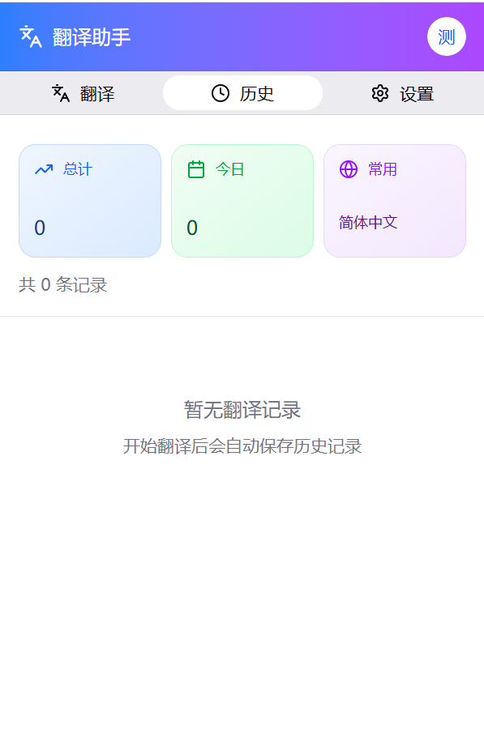
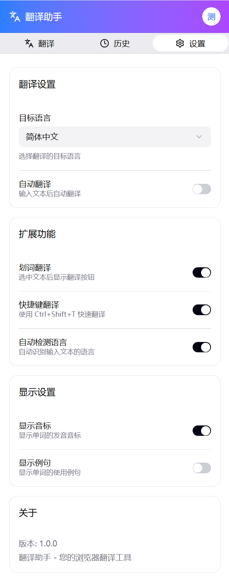
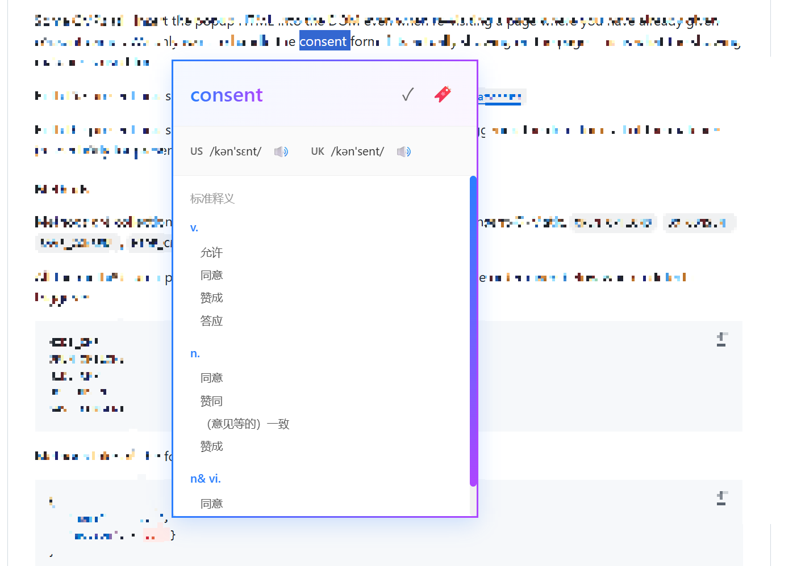
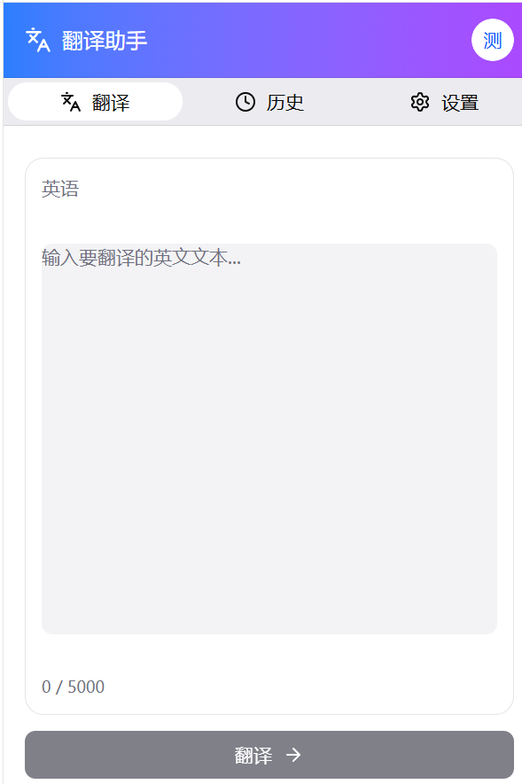

# 翻译助手 - Translation Assistant

一个现代化的跨平台翻译工具，支持Chrome浏览器扩展和Web应用，基于Supabase实现云端数据同步。

## ✨ 主要特性

- 🎯 **双击翻译** - 在任何网页上双击选词即可翻译
- 🌐 **多平台同步** - 基于Supabase实现设置和历史记录云端同步
- 🔐 **账号体系** - 支持邮箱、手机号登录，安全可靠
- 🎨 **现代UI** - 美观的界面设计，流畅的用户体验
- 📊 **翻译历史** - 自动保存翻译记录，支持跨设备查看
- ⚙️ **灵活配置** - API密钥、语言偏好等设置云端同步
- 🔊 **音标显示** - 英文单词自动显示音标和发音
- 💾 **本地缓存** - Chrome扩展离线也能使用基本功能

## 📸 功能展示

### 翻译历史
查看所有翻译记录，支持搜索和管理历史数据。


### 翻译设置
配置腾讯云API密钥、语言偏好等个性化设置。


### 翻译弹窗
双击选词后即时显示翻译结果，包含音标、例句和词典释义。


### 手动翻译
在Web页面手动输入文本进行翻译，支持多语言互译。


## 🚀 快速开始

### 1. 环境要求

- Node.js (可选，用于开发)
- Chrome浏览器
- Supabase账号（用于云端数据存储）
- 腾讯云账号（用于翻译API）

### 2. 配置数据库

1. 登录 [Supabase控制台](https://supabase.com/dashboard)
2. 创建新项目或使用现有项目
3. 在SQL编辑器中执行 `database-init-complete.sql`
4. 配置项目：
   ```bash
   # 复制配置模板
   cp config.example.js config.js

   # 编辑 config.js，填入你的 Supabase 配置
   ```

   在 `config.js` 中填入你的 Supabase 信息：
   ```javascript
   const CONFIG = {
       supabase: {
           url: 'https://your-project.supabase.co',  // 你的项目 URL
           anonKey: 'your-anon-key-here',             // 你的 anon key
           projectId: 'your-project-id'                // 你的项目 ID
       }
   };
   ```

   **注意**：`config.js` 包含敏感信息，已在 `.gitignore` 中，不会被提交到 Git。

### 3. 安装Chrome扩展

1. 生成图标文件：打开 `generate-icons.html` 并下载图标
2. 在Chrome中访问 `chrome://extensions/`
3. 开启"开发者模式"
4. 点击"加载已解压的扩展程序"并选择项目目录

### 4. 配置和使用

1. 打开扩展，注册/登录账号
2. 进入设置 → API配置
3. 输入腾讯云API密钥
4. 开始使用双击翻译功能！

详细步骤请参阅 [快速开始指南](docs/QUICK_START.md)

## 📚 文档目录

### 配置指南
- [快速开始指南](docs/QUICK_START.md) - 新手入门，快速配置
- [Supabase配置](docs/SUPABASE_SETUP.md) - 数据库详细配置说明
- [跨平台同步设置](docs/SYNC-SETTINGS-README.md) - 设置同步机制说明

### 开发文档
- [数据库架构说明](docs/SQL-MERGE-SUMMARY.md) - 数据库表结构和SQL脚本说明
- [Supabase集成指南](docs/README-SUPABASE.md) - Supabase功能详解
- [旧版README](docs/OLD-README.md) - Chrome扩展原始文档

### 测试和调试
- [测试账号](docs/TEST_ACCOUNTS.md) - 开发测试用账号信息

## 📁 项目结构

```
tran/
├── README.md                           # 项目主文档（本文件）
├── docs/                               # 📚 文档目录
│   ├── QUICK_START.md                 # 快速开始指南
│   ├── SUPABASE_SETUP.md              # Supabase配置
│   ├── SYNC-SETTINGS-README.md        # 同步设置说明
│   ├── SQL-MERGE-SUMMARY.md           # SQL脚本说明
│   ├── README-SUPABASE.md             # Supabase集成文档
│   ├── TEST_ACCOUNTS.md               # 测试账号
│   └── OLD-README.md                  # 旧版文档
│
├── database-init-complete.sql         # 完整数据库初始化脚本
│
├── config.example.js                  # 🔧 配置模板（可提交）
├── config.js                          # 🔧 实际配置（已gitignore）
│
├── index.html                          # 登录页面
├── translator.html                     # 翻译主页面
├── popup.html                          # Chrome扩展弹出窗口
│
├── supabase-config.js                  # Supabase配置加载器
├── auth-service.js                     # 认证服务
├── database-service.js                 # 数据库服务
├── background.js                       # Chrome扩展后台脚本
├── content.js                          # Chrome扩展内容脚本
├── translator-supabase.js              # 翻译页面逻辑
├── script-supabase.js                  # 登录页面逻辑
│
├── styles.css                          # 登录页样式
├── translator.css                      # 翻译页样式
├── tooltip.css                         # 翻译提示框样式
├── popup.css                           # 扩展弹出窗口样式
│
├── manifest.json                       # Chrome扩展配置
├── generate-icons.html                 # 图标生成工具
└── supabase.js                         # Supabase SDK（本地版）
```

## 🔧 技术栈

- **前端**: HTML5, CSS3, JavaScript (原生)
- **后端/数据库**: Supabase (PostgreSQL)
- **认证**: Supabase Auth (邮箱、手机号)
- **翻译API**: 腾讯云机器翻译
- **词典API**: Free Dictionary API
- **浏览器扩展**: Chrome Extension Manifest V3

## 🌟 核心功能

### 1. 用户认证
- 邮箱密码登录/注册
- 邮箱验证码登录
- 手机号验证码登录
- Google第三方登录（可选）

### 2. 翻译功能
- 双击选词翻译
- 多语言支持（中、英、日、韩等）
- 自动语言检测
- 音标和发音（英文单词）
- 翻译结果收藏

### 3. 数据同步
- 翻译历史跨设备同步
- API配置云端存储
- 用户偏好设置同步
- 自动备份和恢复

### 4. Chrome扩展
- 划词翻译
- 快捷键支持
- 历史记录管理
- 设置面板

## 💡 使用场景

- 📖 **阅读外文文档** - 快速翻译技术文档
- 🌍 **浏览外文网站** - 即时理解网页内容
- 📝 **学习外语** - 查看单词音标和例句
- 💼 **工作交流** - 准确翻译专业术语

## ⚠️ 注意事项

1. **配置文件**:
   - `config.js` 包含敏感信息，已在 `.gitignore` 中
   - 首次使用需从 `config.example.js` 复制并配置
   - 不要将 `config.js` 提交到 Git 仓库

2. **API密钥安全**: API密钥加密存储在Supabase，但请妥善保管
3. **API配额**: 腾讯云翻译每月500万字符免费额度
4. **网络要求**: 需要访问Supabase和腾讯云API
5. **隐私保护**: 数据通过Supabase RLS策略保护，用户只能访问自己的数据

## 🔐 安全说明

本项目已实施以下安全措施：

- ✅ 配置文件与代码分离（`config.js`）
- ✅ 敏感文件已添加到 `.gitignore`
- ✅ API密钥加密存储（AES-256）
- ✅ Supabase RLS策略保护用户数据
- ✅ 无硬编码密钥或凭证

## 🤝 贡献

欢迎提交Issue和Pull Request！

## 📄 许可证

本项目仅供学习和个人使用。

## 📞 支持

遇到问题？请查看：
1. [快速开始指南](docs/QUICK_START.md)
2. [常见问题](docs/OLD-README.md#常见问题)
3. [GitHub Issues](https://github.com/你的用户名/项目名/issues)

---

**开发时间**: 2025年
**版本**: 2.0 (Supabase Cloud Sync Edition)
**作者**: Your Name
